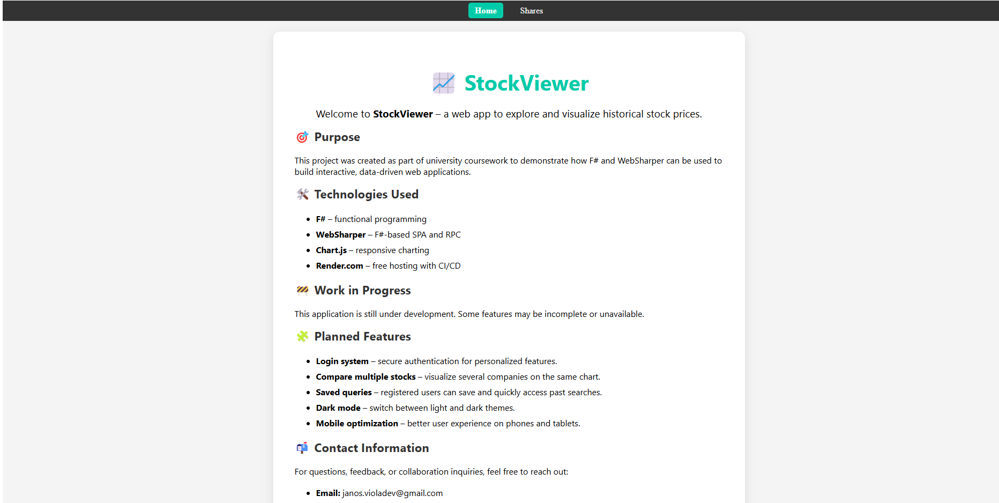
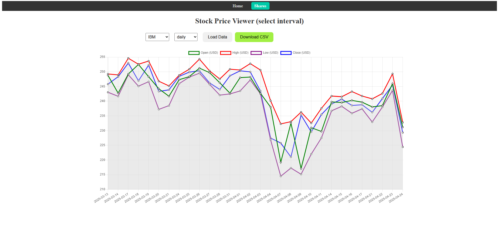

# StockViewer 📈

**StockViewer** is a Single Page Application (SPA) built with F# and WebSharper. It fetches and displays real-time stock prices across different time intervals and data providers. The system automatically switches API keys and falls back to a secondary provider when usage limits are reached.

## 🔧 Features

- ✅ Dropdown menu for selecting a stock (e.g., IBM, AAPL, etc.)
- 📊 Display of stock prices:
  - Hourly, daily, weekly, and monthly intervals
- 🔁 Automatic API key rotation for Alpha Vantage (fallback to TwelveData)
- 🧾 Export stock data to CSV
- 🔗 Persistent navigation bar between pages

## 🛠 Technologies Used

- F# programming language
- [WebSharper](https://websharper.com/) SPA framework
- Alpha Vantage and TwelveData API integration
- WebSharper.Charting for chart visualization
- Custom HTML/CSS via `Style.fs`

## 🚀 Getting Started

### Development

```bash
dotnet tool restore
dotnet run
```

The app will be available at `http://localhost:5000`.

### Deployment with Render.com

This project is hosted on [Render.com](https://render.com) using a custom Docker deployment.  
Render uses the `Dockerfile` located in the root directory to build and run the application.

No additional configuration is required — just connect your GitHub repository to Render and select "Docker" as the environment.

#### Live Demo  
👉 [Try it live!](https://stockviewer-oi64.onrender.com)

## 📁 Project Structure

```
StockViewer/
│
├── Client/             # Client-side F# logic
├── Server/             # Server-side API integration
├── Shared/             # Shared types (e.g., StockDataPoint)
├── wwwroot/            # Static assets
├── style.fs            # Styling definitions
├── StockViewer.fsproj  # Project file
└── README.md           # This file
```

## 📸 Screenshots

### 🏠 Home Page


### 📈 Stock Chart View Before Data Loaded


### 📈 Stock Chart View After Data Loaded

